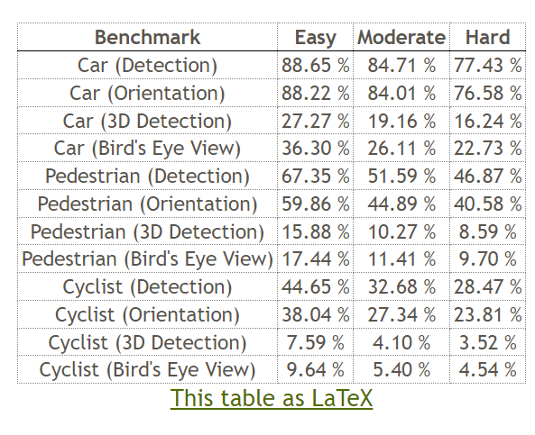
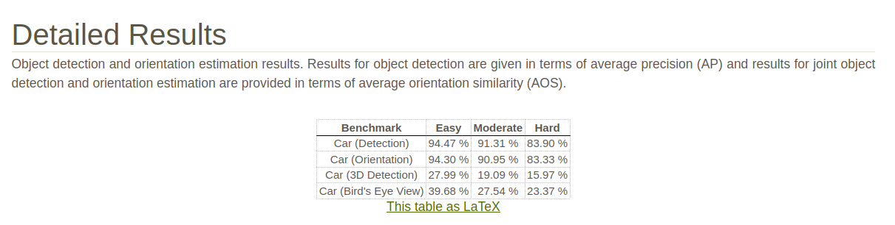

# MonoAGP
A monocular 3D object detection network framework

<h2>Multi-class Results on KITTI Test</h2>

Results are reported by APR40 at IoU &gt; 0.5 for pedestrian and cyclist categories.
The best results are shown in <b>bold</b>. “--” denotes unavailable results.

<table>
  <thead>
    <tr>
      <th rowspan="3">Method</th>
      <th colspan="6">Pedestrian</th>
      <th colspan="6">Cyclist</th>
    </tr>
    <tr>
      <th colspan="3">AP3D</th>
      <th colspan="3">APBEV</th>
      <th colspan="3">AP3D</th>
      <th colspan="3">APBEV</th>
    </tr>
    <tr>
      <th>Easy</th>
      <th>Mod.</th>
      <th>Hard</th>
      <th>Easy</th>
      <th>Mod.</th>
      <th>Hard</th>
      <th>Easy</th>
      <th>Mod.</th>
      <th>Hard</th>
      <th>Easy</th>
      <th>Mod.</th>
      <th>Hard</th>
    </tr>
  </thead>
  <tbody>
    <tr>
      <td><a href="https://github.com/zhangyp15/MonoFlex">MonoFlex</a></td>
      <td>9.43</td>
      <td>6.31</td>
      <td>5.26</td>
      <td>10.36</td>
      <td>7.36</td>
      <td>6.29</td>
      <td>4.17</td>
      <td>2.35</td>
      <td>2.04</td>
      <td>4.41</td>
      <td>2.67</td>
      <td>2.50</td>
    </tr>
    <tr>
      <td><a href="https://github.com/SuperMHP/GUPNet">GUPNet</a></td>
      <td>14.72</td>
      <td>9.53</td>
      <td>7.87</td>
      <td>15.62</td>
      <td>10.37</td>
      <td>8.79</td>
      <td>4.18</td>
      <td>2.65</td>
      <td>2.09</td>
      <td>6.94</td>
      <td>3.85</td>
      <td>3.64</td>
    </tr>
    <tr>
      <td><a href="https://github.com/Xianpeng919/MonoCon">MonoCon</a></td>
      <td>13.10</td>
      <td>8.41</td>
      <td>6.94</td>
      <td>--</td>
      <td>--</td>
      <td>--</td>
      <td>2.80</td>
      <td>1.92</td>
      <td>1.55</td>
      <td>--</td>
      <td>--</td>
      <td>--</td>
    </tr>
    <tr>
      <td><a href="https://github.com/ZrrSkywalker/MonoDETR">MonoDETR</a></td>
      <td>12.65</td>
      <td>7.19</td>
      <td>6.72</td>
      <td>--</td>
      <td>--</td>
      <td>--</td>
      <td>5.12</td>
      <td>2.74</td>
      <td>2.02</td>
      <td>--</td>
      <td>--</td>
      <td>--</td>
    </tr>
    <tr>
      <td><a href="https://github.com/pufanqi23/MonoDGP">MonoDGP</a></td>
      <td>15.04</td>
      <td>9.89</td>
      <td>8.38</td>
      <td>--</td>
      <td>--</td>
      <td>--</td>
      <td>5.28</td>
      <td>2.82</td>
      <td>2.65</td>
      <td>--</td>
      <td>--</td>
      <td>--</td>
    </tr>
    <tr>
      <td><b>Ours</b></td>
      <td><b>15.88</b></td>
      <td><b>10.27</b></td>
      <td><b>8.59</b></td>
      <td><b>17.44</b></td>
      <td><b>11.41</b></td>
      <td><b>9.70</b></td>
      <td><b>7.59</b></td>
      <td><b>4.10</b></td>
      <td><b>3.52</b></td>
      <td><b>9.64</b></td>
      <td><b>5.40</b></td>
      <td><b>4.54</b></td>
    </tr>
  </tbody>
</table>

Our network in the geometric feature extraction branch：

Here are the MonoAGP 3cls test results:

Here are the MonoAGP car test results (data:20250930):

Our complete code will be published soon. Thank you for waiting!
